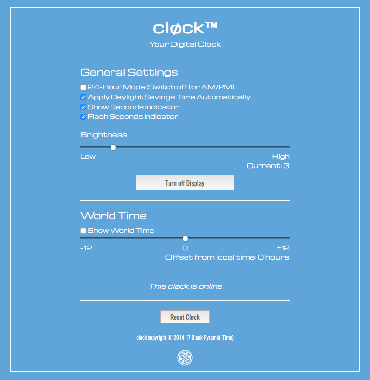

# cløck 1.0

A very simple four-digit timepiece developed using the [Electric Imp Platform](https://electricimp.com/docs/). It makes use of the [Adafruit 0.56-inch 4-digit, 7-segment LED display](http://www.adafruit.com/products/878), which is based on the Holtek HT16K33 controller.

## Hardware

### Ingredients

- 1x [Electric Imp Developer Kit](https://electricimp.com/docs/gettingstarted/devkits/)
- 1x [Adafruit 1.2in 8x8 LED Matrix + I&sup2;C Backpack](https://www.adafruit.com/products/1856)
- 4x short female-to-female connector wires

### Assembly

1. Assemble the Adafruit display and backpack
1. Solder connector pins to the Electric Imp April breakout board.
1. Slot the imp001 card into the breakout board
1. Use the connector wires as per the table below

| April Pin | LED Pin |
| --- | --- |
| GND | - |
| 3V3 | + |
| Pin1 | SCL |
| Pin2 | SDA |

## Software

### Setup

1. Visit [Electric Imp](https://ide.electricimp.com/login/) to sign up for a free developer account. You will be asked to confirm your email address.
2. Visit Electric Imp’s [Getting Started Guide](https://electricimp.com/docs/gettingstarted/blinkup/) to learn how to configure your imp001 to access your local WiFi network, and how to enter code into the IDE and run it on your device.

## User Interface

Visit your cløck’s agent URL for a control interface.

## Licence

The cløck design and software is copyright &copy; 2014-17 Tony Smith and made available under the [MIT Licence](./LICENSE).
