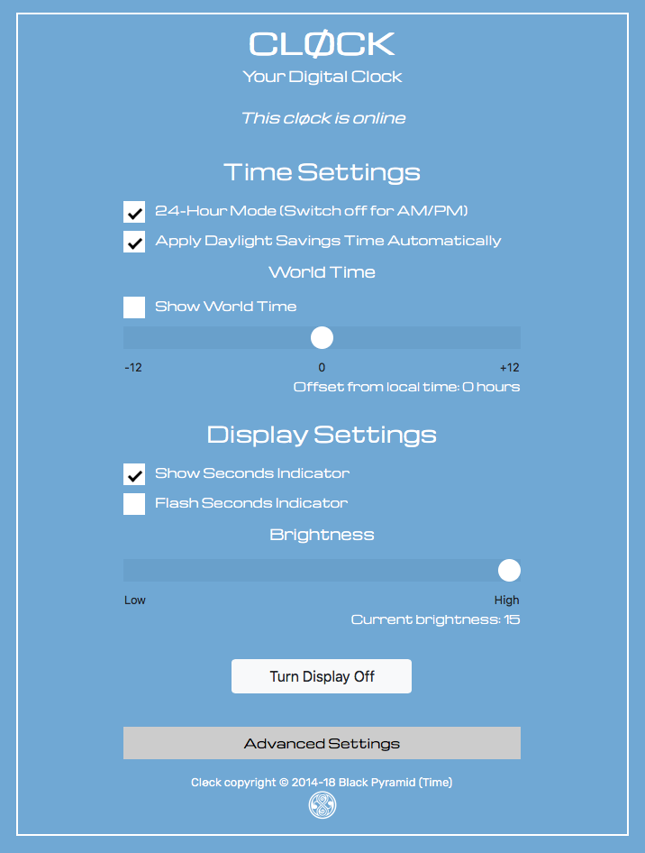

# cløck 2.1.0 #

A very simple four-digit timepiece developed using the [Electric Imp Platform](https://electricimp.com). It makes use of the [Adafruit 0.56-inch 4-digit, 7-segment LED display](http://www.adafruit.com/products/878), which is based on the Holtek HT16K33 controller.

## Hardware ##

### Ingredients ###

- 1x [Electric Imp Developer Kit](https://developer.electricimp.com/gettingstarted/devkits)
- 1x [Adafruit 1.2in 8x8 LED Matrix + I&sup2;C Backpack](https://www.adafruit.com/products/1856)
- 4x short female-to-female connector wires

### Assembly ###

1. Assemble the Adafruit display and backpack
1. Solder connector pins to the Electric Imp April breakout board.
1. Slot the imp001 card into the breakout board
1. Use the connector wires as per the table below

| April Pin | LED Pin |
| --- | --- |
| GND | - |
| 3V3 | + |
| Pin1 | SCL |
| Pin2 | SDA |

## Software ##

### Setup ###

1. Visit [Electric Imp impCentral](https://impcentral.electricimp.com/login/) to sign up for a free developer account. You will be asked to confirm your email address.
2. Visit Electric Imp’s [Getting Started Guide](https://developer.electricimp.com/gettingstarted/blinkup) to learn how to configure your imp001 to access your local WiFi network, and how to enter code into the IDE and run it on your device.

## User Interface ##

Visit your cløck’s agent URL for a control interface.

## Release Notes ##

- 2.1.0 &mdash; *Unreleased*
    - Sync agent and device code with [MatrixClock](https://github.com/smittytone/MatrixClock)
    - Add night mode
    - Revise alarms code
    - Add API debugging
    - Remove redundant agent-side server.save() result checks
    - Update dependencies (Bootstrap 4.3.0; Rocky 2.0.0; HT16K33Segment 2.0.0)
- 2.0.0 &mdash; *1 November 2018*
    - Update to [Bootstrap 4.1.3](https://getbootstrap.com/)
    - Completely redesign agent API
    - Add alarms
    - Controller support
    - Fix CSS bugs
    - Display a leading zero in 24-hour mode (times below 10am)
- 1.4.0 &mdash; *13 June 2018*
    - Update to [Bootstrap 4.1.1](https://getbootstrap.com/)
    - Update Web UI based on Bootstrap
    - Separate out Web UI into own file for clarity
    - Add [DisconnectionManager](https://github.com/smittytone/generic/blob/master/disconnect.nut) support
    - Upgrade [Rocky](https://developer.electricimp.com/libraries/utilities/rocky) to 2.0.1
    - Update to [JQuery 3.3.1](https://jquery.com)
    - Prevent Ajax XHR cacheing
- 1.3.0
    - Minor changes and bug fixes.

## Licence ##

The cløck design and software is copyright &copy; 2014-19 by Tony Smith. It is made available under the [MIT Licence](./LICENSE).
